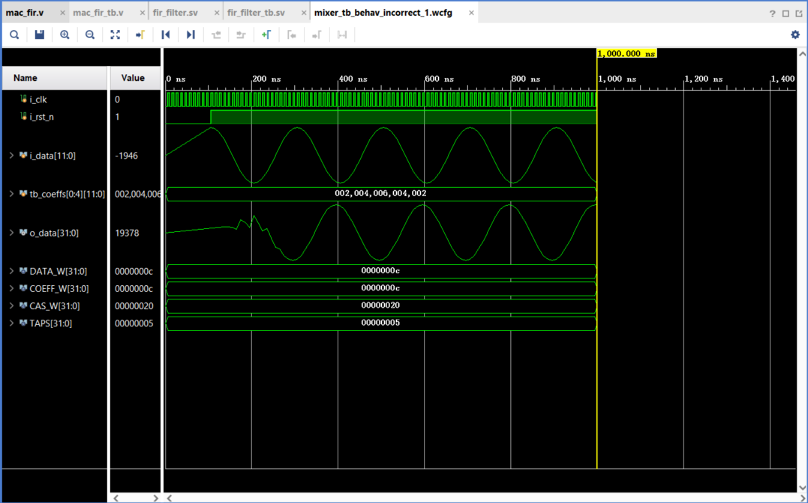

# fir_filter using sine and cosine input

This is `fir_filter.sv`

```
`timescale 1ns / 1ps

module fir_filter #(
    parameter DATA_W  = 12,  // 12
    parameter COEFF_W = 12,  // 12
    parameter CAS_W   = 32,  // 32
    parameter TAPS = 5  // 32
)(
    input i_clk,
    input i_rst_n,
    input signed [DATA_W-1:0] i_data,
    input signed [COEFF_W-1:0] i_coeffs [0:TAPS-1], // Clean 2D array port
    output reg signed [CAS_W-1:0] o_data
);

    // Delay line for 32-tap (x0 to x30, x31 is direct input)
    reg signed [DATA_W-1:0] x [0:TAPS-2];
    integer k;

    always @(posedge i_clk or negedge i_rst_n) begin
        if (!i_rst_n) begin
            for (k = 0; k < TAPS-1; k = k + 1) begin
                x[k] <= 0;
            end
        end 
        else begin
            x[0] <= i_data;
            for (k = 1; k < TAPS-1; k = k + 1) begin
                x[k] <= x[k-1];
            end
        end
    end


    // MAC Chain (From Tap 31 down to Tap 0)
    wire signed [CAS_W-1:0] m [0:TAPS-1];
    genvar i;
    
    generate
        for (i = 0; i < TAPS; i = i + 1) begin : mac_loop
            // Extract the specific coefficient from the flattened input vector
            wire signed [COEFF_W-1:0] current_coeff = i_coeffs[i];
            
            // Determine the data input for this specific tap
            wire signed [DATA_W-1:0] current_data = (i == 0) ? i_data : x[i-1];

            if (i == TAPS-1) begin : last_tap
                // First stage in the cascade chain (Tap 31 in original code)
                mac_fir #(DATA_W, COEFF_W, CAS_W, CAS_W) dut_mac (
                    .i_clk(i_clk), 
                    .i_rst_n(i_rst_n),
                    .i_data(current_data), 
                    .i_coeff(current_coeff), 
                    .i_cascade_in({CAS_W{1'b0}}), 
                    .o_cascade_out(m[i])
                );
            end 
            else begin : mid_taps
                // Middle stages and final stage (Tap 30 down to Tap 0)
                mac_fir #(DATA_W, COEFF_W, CAS_W, CAS_W) dut_mac (
                    .i_clk(i_clk), 
                    .i_rst_n(i_rst_n),
                    .i_data(current_data), 
                    .i_coeff(current_coeff), 
                    .i_cascade_in(m[i+1]), 
                    .o_cascade_out(m[i])
                );
            end
        end
    endgenerate

    // Final output registration
    always @(posedge i_clk or negedge i_rst_n) begin
        if (!i_rst_n)
            o_data <= {CAS_W{1'b0}};
        else
            o_data <= m[0]; // Final accumulated results
    end

endmodule
```

This is `fir_filter_tb.sv` for sine input, change the `sin` to `cos` on the line `i_data <= $rtoi(amplitude * $sin(2.0 * pi * frequency * step / sampling_rate));` for the cosine input version of the code.

```
`timescale 1ns / 1ps

module fir_filter_tb;

    // Parameters
    parameter DATA_W  = 12;  // 12
    parameter COEFF_W = 12;  // 12
    parameter CAS_W   = 32;  // 32
    parameter TAPS = 5;

    // Inputs
    reg i_clk;
    reg i_rst_n;
    reg signed [DATA_W-1:0] i_data;
    
    reg signed [COEFF_W-1:0] tb_coeffs [0:TAPS-1];

    // Outputs
    wire signed [CAS_W-1:0]  o_data;

    // Unit Under Test
    fir_filter #(
        .DATA_W(DATA_W),
        .COEFF_W(COEFF_W),
        .CAS_W(CAS_W),
        .TAPS(TAPS)
    ) uut (
        .i_clk(i_clk),
        .i_rst_n(i_rst_n),
        .i_data(i_data),
        .i_coeffs(tb_coeffs),
        .o_data(o_data)
    );

    // Clock Generation 
    always begin
        #5 i_clk = ~i_clk; // 100MHz clock
    end
    
    real pi = 3.14159265358979323846;
    real frequency = 5000000;         // Desired Sine Wave Frequency: 5 MHz
    real sampling_rate = 100000000;   // Your Clock Rate: 100 MHz (10ns period)
    real amplitude = 2047.0;          // Max amplitude for 12-bit signed integer (2^11 - 1)
    integer step = 0;

    // Stimulus Block
    initial begin
        // Initialize Inputs
        i_clk   = 1'b0;
        i_rst_n = 1'b0;
        i_data  = {DATA_W{1'b0}};
        
        // coefficients
        tb_coeffs[0] = 12'sd2;  
        tb_coeffs[1] = 12'sd4;  
        tb_coeffs[2] = 12'sd6;  
        tb_coeffs[3] = 12'sd4;  
        tb_coeffs[4] = 12'sd2;

        #100;
        
        // Release Reset
        @(posedge i_clk);
        i_rst_n = 1'b1;
        
        // Apply Step Input to observe impulse/step response across 32 taps
        @(posedge i_clk);
        i_data = 12'sd10;
        
        // Run simulation long enough to let the data propagate through all 32 stages
        #1000;
        
        // Finish simulation
        $finish;
    end
    
    always @(posedge i_clk) begin
        if (!i_rst_n) begin
            i_data <= {DATA_W{1'b0}};
            step   <= 0;
        end else begin
            // Amplitude * sin(2 * pi * f * t)
            i_data <= $rtoi(amplitude * $sin(2.0 * pi * frequency * step / sampling_rate)); 
            step   <= step + 1;
        end
    end

endmodule
```

## Graph for sine input
 

## Graph for cosine input
